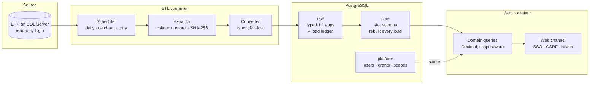

# ERP → Warehouse → Governed BI: an architecture write-up

How I designed and shipped an internal analytics platform that replaced a legacy reporting stack at
a manufacturer, and how it proves its own numbers are right.

This repository contains no source code and no data. It is the architecture, the decisions, and the
trade-offs I would defend in an interview. The implementation is private. I am building a runnable
version of the pipeline on synthetic data; it will be linked here when it is public.

Stack: Python 3.12, Flask, PostgreSQL 16, psycopg3, gunicorn, Docker, GitHub Actions, OIDC against
Microsoft Entra ID. Source system is a hosted ERP on SQL Server, read through unixODBC.

---

## 1. The problem

A manufacturer ran finance and commercial reporting on a legacy in-house application reading
straight from the ERP. It was trusted, and it agreed with itself. It disagreed with the ledger in
ways no total would show, because the errors were in the signs and in the deduplication, and errors
like that cancel at the top and only appear cell by cell.

So the job was not "build a better dashboard". It was: replace a system everyone trusts, with one
that produces different numbers, and prove the new numbers are the correct ones without asking
anyone to take that on faith.

## 2. How it works

Two container images, one database. The ODBC driver and the ERP credential exist only in the ETL
image, and the web application code never enters it. The ETL owns the `raw` and `core` schemas; the
web app never writes to either.

| Document | What it covers |
|---|---|
| [Architecture and boundaries](docs/01-architecture.md) | The layers, the boundary rules, and how most of them are checked mechanically at write time |
| [Ingestion](docs/02-ingestion.md) | Load ledger, state machine, transactionality, advisory locks, retries, shutdown, error sanitization |
| [Data model](docs/03-data-model.md) | `raw`/`core` layering, star schema, grain, and why the fact tables have no unique key |
| [Identity and authorization](docs/04-authorization.md) | OIDC identity matching, a takeover path closed three ways, row-level scope that reaches the SQL |
| [Delivery](docs/05-delivery.md) | Image design, CI topology, supply-chain pinning, and a deploy gate that verifies the commit in production |
| [Proving it correct](docs/06-parity-harness.md) | The parity harness. This is the part I would most want to be asked about |
| [Decision records](docs/adr/) | Eight ADRs, each with the option I rejected |

## 3. The decisions that shaped it

Short version; the reasoning is in the linked documents.

- **`DELETE`, not `TRUNCATE`, when rebuilding the analytical layer.** `TRUNCATE` inside the rebuild
  transaction holds an `ACCESS EXCLUSIVE` lock until commit, so every dashboard query blocks for the
  whole rebuild. → [ADR-0003](docs/adr/0003-delete-not-truncate.md)
- **The load ledger is the backbone, not a log table.** A row written and committed before any data
  moves, advancing through committed state transitions, with its id as a foreign key on every fact
  row. → [Ingestion](docs/02-ingestion.md#the-load-ledger)
- **No unique key on the fact tables.** The budget source contains genuinely identical rows that the
  business rule sums. A `DISTINCT` would delete budget.
  → [ADR-0006](docs/adr/0006-no-unique-key-on-facts.md)
- **Authorization scope is immutable and has no default value.** Request filters use "empty means no
  filter"; scope uses "empty means sees nothing". One accidental default and an unmarked user sees
  the whole company. → [Authorization](docs/04-authorization.md#scope-reaches-the-query)
- **A deploy is not green until production says so.** The build SHA reaches the app's health
  endpoint, and CI polls production until it reads that SHA back.
  → [Delivery](docs/05-delivery.md#the-deploy-gate)

## 4. How to read this

Start with [Architecture and boundaries](docs/01-architecture.md) for the shape, then
[Proving it correct](docs/06-parity-harness.md). The ADRs are short and read in any order.

## 5. What I would do differently

- **Ingestion is a full refresh with no incremental path.** Everything is materialized in memory,
  single-threaded. It works at this volume and will not survive an order of magnitude. A
  modification-timestamp watermark with periodic full reconciliation is the next step, and I have
  not built it.
- **A hand-rolled scheduler instead of an orchestrator.** It handles catch-up, retries, and
  shutdown, and it still gives no DAG, no backfill, no per-stage retry. Dagster or Airflow was the
  right call and I deferred it for cost.
- **No alerting.** Failures are persisted and visible on an admin screen, which means a human has to
  go and look. For a daily financial pipeline that is the largest operational gap.
- **The parity harness cannot run in CI**, because its fixtures are real accounting values that must
  not leave the company. Synthetic fixtures would have cost more up front and would have been worth
  it.
- **No indexes beyond primary keys**, and no query-performance measurement. Nothing hurts yet, which
  is not the same thing as fine.
- **Everything is written in Portuguese**, which was right for the team and wrong for anyone else
  who ever has to read it.

---

*Generalized throughout: no employer, no hostnames, no data. The reasoning is the portable part.*
[MIT](LICENSE).

