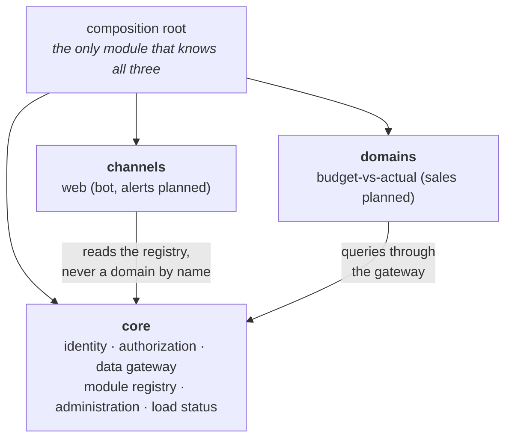
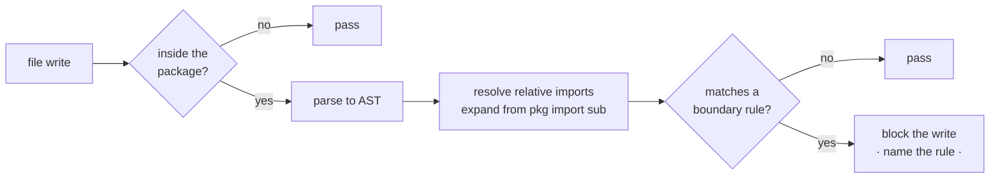

# Architecture and boundaries

There is one business domain in production today and one delivery channel. The requirement was that
a second of each could be added without the two reaching into one another, and that requirement,
rather than any aesthetic preference, produced the layering. It is a bet, and it is worth naming as
one: if the second domain never arrives, this structure cost more than it returned.

## Three layers and a composition root

**core** holds identity, authorization, the single database gateway, the module registry,
administrative invariants and load freshness. **channels** are delivery mechanisms and hold no
business logic. **domains** own their queries, screens and rules.

The composition root is the only module that imports all three. It wires configuration, the
connection pool, the schema, the blueprints and the domain registrations, then runs a boot-time
validation that fails fast.

## The rules

1. A domain never imports another domain.
2. A channel holds no business logic and never names a domain.
3. Core imports neither channels nor domains.
4. A domain never opens a database connection.
5. Authorization always happens in core, never in a channel.

Rule 5 pays for the rest. The web channel and a future bot channel call the same function to decide
what a person may see, so an authorization check cannot drift between them by being rewritten
slightly differently for each.

## How the dependency inversion works

Domains register themselves from the composition root; channels read the registry and never learn a
domain's name.

That means core holds a reference to something the web channel created, a Flask blueprint, without
depending on Flask. The registry entry types it as an opaque object on purpose. Core carries it and
never calls it. The same applies to the callable a domain supplies to declare what its access scope
can be marked against: core knows there are scope item types, and never knows they are cost centres.

The in-code registry is the source of truth and is mirrored into a table so user grants can have a
real foreign key. Access is the intersection of the database grant and the live registry, so a grant
to a module that no longer exists in code grants nothing.

## Enforcement rather than discipline

Rules in a document erode, particularly on a codebase developed with AI assistance at high
throughput, where the failure mode is not bad syntax but a system that stops having a shape. Four of
the five are checked by a static analysis hook on every file write.

Three details earn their complexity. Relative imports are resolved to their absolute form, and
`from package import submodule` is expanded to the qualified name, because those are the two most
natural ways to import inside a package and a gate that misses them provides false confidence.
Message deduplication is scoped to one statement rather than by prefix, because a prefix dedup would
swallow a genuine second violation, and a gate that silently swallows a violation is worse than no
gate.

It fails open on infrastructure problems, so an unreadable file or a syntax error can never wedge an
editing session. It does not attempt rule 5 and says so in its own docstring: the correct pattern
and the forbidden one are the same import, distinguished only by where the call happens. A gate that
cannot enforce a rule should declare that rather than approximate it.

## Request flow

1. `ProxyFix` normalizes scheme and host so redirect URIs are built correctly behind TLS
   termination.
2. The router dispatches to a blueprint registered from the registry loop, not hard-coded.
3. A decorator reloads the user from the database on every request and drops the session if the
   account is missing or deactivated, so a revoked account loses access on its next request rather
   than at token expiry.
4. Module access is checked in core, with distinct responses for an expired session and for no
   access to that module, because they ask different things of the user.
5. The screen layer asks core for the user's row-level scope, read fresh from the database and never
   stored in the session.
6. The domain runs its query through the gateway with the scope as a required argument.
7. Aggregation happens in `Decimal`. Conversion to float occurs only at the JSON boundary.
8. The response carries the data's freshness, so a stale load is visible on the screen itself.

## Boot-time validation

The application factory refuses to start if any registered module's entry point does not resolve.
Without it, an unresolvable endpoint raises inside the navigation-menu context processor, which runs
on every page, so one typo in one module becomes a site-wide outage found by a user rather than by
the person deploying.

---

**Related:** [ADR-0001](adr/0001-layering-and-registry.md) ·
[ADR-0002](adr/0002-enforce-boundaries-with-a-hook.md)

