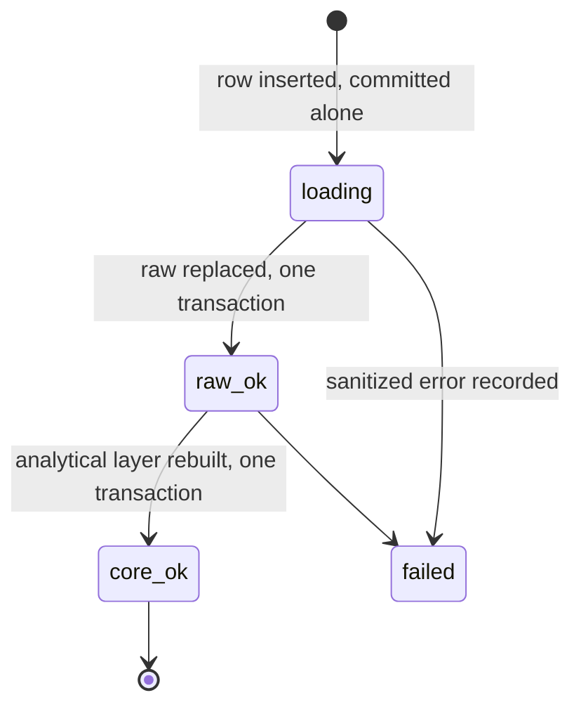

# Ingestion

The pipeline runs once a day against a hosted ERP on SQL Server and lands in PostgreSQL. It is a
full refresh. Most of the engineering in it is not about moving rows; it is about making sure that
when something goes wrong, the system can say exactly how far it got.

## The load ledger

Every run is a row in a ledger table, written before any data moves and committed on its own.

The row carries the origin, the extraction timestamp, the requested window, a SHA-256 per source
table computed over the extracted tuples, and a row count per table. Every fact row in both layers
carries the load id as a foreign key, so any number on a screen traces back to the run that produced
it.

Four transactions, in order: schema DDL, the `loading` marker, the raw replacement with its state
transition, the analytical rebuild with its state transition. Each transition commits with the work
it describes, so the recorded state can never claim more than what was durably written.

### Why the connection must be in autocommit

The load connection must be in autocommit, and the code raises if it is not.

This is psycopg3 behaviour and it is worth being precise about. On an idle connection, the first
`with conn.transaction()` block issues a real `BEGIN` and `COMMIT`. But once any statement has
already opened the implicit transaction, every subsequent `transaction()` block is implemented as a
`SAVEPOINT` and released rather than committed. The `loading` marker would then only reach disk at
the very end, and a process killed in the middle would leave no trace at all, which is the one thing
the marker exists to prevent.

The underlying requirement is that each state transition commits independently. Explicit
`conn.commit()` calls would satisfy it too; autocommit plus explicit transaction blocks is the
cleanest way to get there, and the runtime check exists because the failure is invisible until an
incident.

## Concurrency: try, do not wait

Two loads must never overlap. The lock is a PostgreSQL session-level advisory lock, taken with
`pg_try_advisory_lock` on a connection dedicated to the load.

Try rather than wait: queueing behind the other load and then reloading on top of it is not useful
behaviour, so the second run exits. It is acquired twice on that same dedicated session, once before
the ERP is touched and once inside the load itself, which is safe because session-level advisory
locks are reentrant within a session; the outer acquisition avoids opening an ERP connection for a
run that is about to exit. A session-level lock taken twice must be released twice, and here it is
released by the session closing.

The lock therefore clears itself when the connection closes, including when the process is killed,
though on a hard kill that happens when the server notices the connection is gone rather than
instantly.

## `DELETE`, not `TRUNCATE`

The analytical layer is rebuilt completely on every load, inside one transaction, and emptied with
`DELETE`.

`TRUNCATE` takes an `ACCESS EXCLUSIVE` lock, and because it runs inside the rebuild transaction that
lock is held until commit, so every dashboard query blocks for the whole rebuild rather than for the
truncate. `DELETE` takes `ROW EXCLUSIVE`, which does not conflict with readers: a query during the
rebuild sees the entire previous model and flips to the new one at commit.

`TRUNCATE` is additionally not MVCC-safe. A transaction holding a snapshot taken before it will find
the table empty afterwards, which matters for any reader at `REPEATABLE READ` or above.

Pinned by a concurrency test, because a future performance optimization would otherwise undo it
quietly. → [ADR-0003](adr/0003-delete-not-truncate.md)

## Typing at the boundary, and failing fast

Legacy ERP data arrives with fixed-width padding, dates stored as eight-character strings, and
optional fields that are blank rather than null. Conversion happens once, on ingest.

- Text is stripped, and null becomes the empty string, because a business rule requires "no cost
  centre" and "empty cost centre" to be the same dimension member. Every text column in `raw` is
  therefore `NOT NULL`.
- Dates parse only from an exact eight-digit form. `datetime` is checked before `date`, because it
  is a subclass of it.
- Money becomes `Decimal` quantized to the cent and rejects anything that is not an exact multiple.
  Some source money columns arrive as float, which is the only reason a tolerance exists at all: one
  ten-thousandth of a cent, enough to absorb float64 representation error and nothing beyond it.
  `bool` is explicitly rejected, because it is a subclass of `int` and `True` must not become 1.00.

The legacy extractor converted with `errors="coerce"`: an invalid date became null and the row
vanished from the model, an invalid value became zero, silently. A wrong number that looks plausible
survives far longer than a load that refuses to run, so invalid data raises here and the load does
not enter. The risk was measured before adopting it, at zero occurrences across the historical
extract.

## Scheduling, retries, shutdown

An in-process scheduler rather than cron, so the schedule travels with the image and the container
stays the unit of deployment.

- Daily at a configured time in the business timezone, not the container's UTC clock.
- Catch-up on boot if the last good load is older than 24 hours, so a restart after an outage
  recovers by itself.
- Two retries after a failure, at +30 and +60 minutes. Fixed rather than exponential, and applied
  even to configuration and permission errors, because a permission fixed on the source server does
  not restart this container and the cost of finding out an hour later instead of a day later is two
  extra ledger rows.
- Sleep is sliced into chunks of at most five minutes, stepping once per second and recomputing
  against wall-clock time on each slice. A monotonic clock does not advance while the host is
  suspended, so a single multi-hour sleep wakes up late after a VPS pause. The one-second step is
  also what makes shutdown land inside Docker's default ten-second grace period.
- Shutdown on `SIGTERM` or `SIGINT` sets a plain boolean, deliberately not a `threading.Event`:
  `Event.set()` acquires the underlying condition lock, and a signal arriving while the same event's
  `wait()` holds that lock can self-deadlock the process until `SIGKILL`. The handler also sets the
  flag before logging, because logging takes its own lock. An in-flight load is never interrupted;
  the loop exits after it finishes.

## Refusing to run with write access

Before a single row is read, the extractor probes the source login: two role memberships and three
write permissions across each of the four tables. If the login can write, it aborts.

It also aborts when a probe returns `NULL`, because a check that did not answer is not proof of
read-only access. That case has its own exception type so that whoever refuses one refuses the
other. An extractor running unattended with a write-capable credential is the scenario this exists
to prevent.

## Error paths must not leak

Two kinds of secret escape through error messages.

**Credentials.** The sanitizer replaces the full ODBC connection string and each field individually,
handles the brace-escaped and `repr`-escaped forms, matches case-insensitively and longest-first,
and truncates after redacting rather than before, since a secret cut in half by a length limit leaks
half a secret. Exception chaining is severed so the original message cannot resurface through the
context.

**Business data.** A PostgreSQL constraint violation includes the failing row in its `DETAIL` field,
which here means real accounting values. Errors are reduced to the primary message, and a conversion
failure is reported as a location — table, column, row number — with no value attached.

## What this design does not do

- No incremental load, no change data capture, no watermark.
- No parallelism. Four tables, sequentially.
- No alerting. Failures are persisted and displayed; nothing pushes.
- No data-quality circuit breaker. A load extracting zero rows would succeed and blank the
  dashboards. Row counts are recorded per load and nothing compares them across loads, which is the
  cheapest high-value guard still missing.

---

**Related:** [ADR-0004](adr/0004-full-refresh.md) · [ADR-0005](adr/0005-in-process-scheduler.md)
