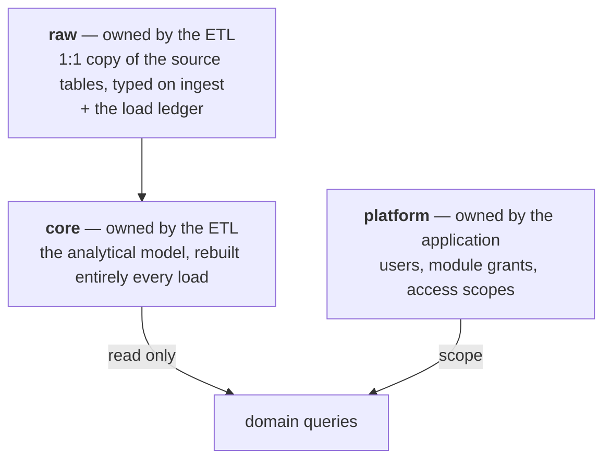

# Data model

Three schemas in one database, with different owners and different lifecycles.

Separating `platform` from `core` is not tidiness. Rebuilding the analytical model must never be
able to touch a user or a permission, and putting them in different schemas with different owners is
what makes that structural rather than careful.

## Layering

`raw` is closer to silver than to bronze: a 1:1 copy of the source tables, already typed. Dates as
`date`, money as `numeric`, text trimmed, nulls normalized. There is no untyped landing zone, which
is a deliberate trade — type errors surface at ingest, where there is a person and a retry,
rather than inside an aggregation three layers downstream.

`core` is the gold layer: two conformed dimensions, two fact tables, and one pre-aggregated
comparative grain table that the screens consume directly. Fully rebuilt every load, in one
transaction. No history lives here; history lives in the ledger.

Business logic used in more than one place is defined once as a SQL function and called from both.
The two in use are pure scalar expressions over their arguments, so they are correctly marked
`IMMUTABLE`. A function that read a table would have to be `STABLE`, and marking that one
`IMMUTABLE` would let the planner constant-fold a result that is no longer true.

## Keys and grain

| Table | Grain | Key |
|---|---|---|
| dimension: account | one account | account code |
| dimension: cost centre | one cost centre | cost centre code |
| fact: ledger entries | one side of one accounting entry | none |
| fact: budget | budget resolved to the winning revision | branch, account, cost centre, period start |
| aggregate: comparative grain | month × account × cost centre | that triple |

Two of those need explaining.

### The fan-out

An accounting entry has a debit side and a credit side, and the cost centre only exists on whichever
side represents a result account. To join cleanly to the dimensions, each source row becomes two
rows, each carrying its own account, its own cost centre and the full value, produced with a lateral
join over a two-row values list.

The sign convention is materialized as a column at load time rather than computed per query: debit
positive, credit negative, inverted for revenue accounts, because a credit on an expense account is
a reversal and must reduce the expense. Summing both sides instead is a mistake that leaves the
grand total looking reasonable while individual cost centres are wrong.

### No unique key on the fact tables

The budget source contains rows identical in every extracted column, and the business rule sums
them. A unique key, a `DISTINCT`, or a `drop_duplicates` would silently delete budget.

This matters more than it looks, because in the same pipeline there genuinely was a duplication
problem: entries existing in two currencies arrived twice with identical values. The correct fix was
a filter on the currency column at the source, not a dedup, because the data also contains
legitimately repeated rows — dozens of identical bank fees posted on the same day — that a dedup
would have destroyed too.

> The two bugs look identical in a row count and have opposite fixes. Only the business rule tells
> you which is which.

The same discipline applied to budget revisions. Rather than assuming the newest revision replaces
the previous one, it was proven: the new revision touches a set of keys already present in the old
one, changes many of the individual values, and leaves the sum over those keys identical to the
cent. That is only consistent with a reallocation, so replacement is correct and summing is not.

## Small modelling decisions that prevented real bugs

- **The null dimension member is a real member.** "No cost centre" is inserted into the dimension as
  a sentinel with a join key rather than handled as a display label. A null foreign key finds no row
  in the dimension, so an inner join drops it and the cost centre disappears from the screen with no
  error anywhere. The same hazard exists in pandas, where `groupby` drops null keys by default.
- **Full outer join for cell completeness**, so a cell with budget but no actuals, or the reverse,
  appears with a zero on the other side instead of hiding overspend on unbudgeted lines.
- **Labels are joined after aggregation**, for the same null-key reason.
- **A sparse representation instead of a pivot.** The matrix screen emits only the pairs that have a
  value, roughly a fifth of the possible combinations, and pivots in the browser.
- **Hierarchical codes get an explicit sort key**, since lexicographic ordering puts `A.4.12` before
  `A.4.2`.
- **An empty cell renders as an em dash, never as zero.** "This combination does not exist" and "it
  exists and came to zero" are different facts to someone reconciling against an official report.

## Schema migration: the honest state

Schema DDL is idempotent and re-applied on every load; every statement is `IF NOT EXISTS` or
`CREATE OR REPLACE`. The exception, changing a column on an existing table, uses a guarded
conditional block that only runs when the change is still needed, specifically so it does not take
an `ACCESS EXCLUSIVE` lock on every load for nothing.

That works and it does not scale. There is no migration tool, no version history, no
down-migrations. Past a handful of changes this is the wrong answer, and I would reach for a
migration tool before the next domain is added.

---

**Related:** [ADR-0006](adr/0006-no-unique-key-on-facts.md) · [ADR-0007](adr/0007-idempotent-ddl.md)
