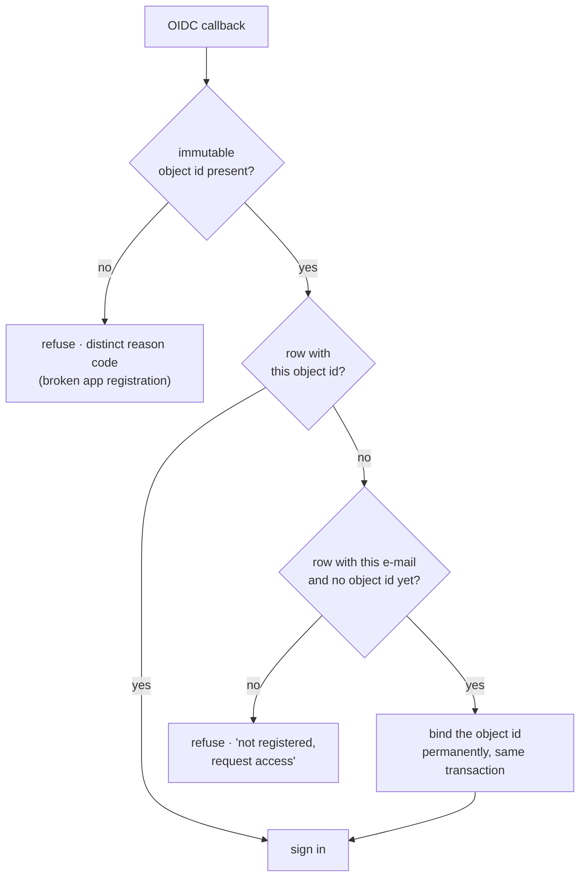

# Identity and authorization

The system holds accounting data. Authentication is corporate SSO through a single-tenant OIDC
registration against Microsoft Entra ID. Authorization is a separate question with a separate
answer, and keeping the two apart is the whole design.

> Authenticating against the corporate directory proves who the person is. It does not prove they
> may see the company's budget.

There is no local password and no emergency account. Every user is registered by an administrator
before their first successful login.

## Identity matching

Match on the directory's `oid` first, then on e-mail where no `oid` has been bound yet, binding it
on that first login. The ordering follows from a property of each claim: `oid` is immutable but
unknowable in advance, so an administrator cannot pre-register with it; e-mail is knowable in advance
and changes. (`oid` is unique within a tenant, which is sufficient here because the registration is
single-tenant.)

Three refusal paths, each with its own reason code:

- **Not registered** returns "request access", never "invalid credentials". Telling someone with
  valid corporate credentials that they are invalid produces a support ticket and teaches them to
  distrust the login.
- **No `oid` in the token** points at a misconfigured application registration rather than at the
  user.
- **Deactivated** is handled on every request rather than at token expiry.

Changing a user's e-mail clears the bound `oid`, so a re-pointed row cannot keep authenticating the
previous person. The symmetry is worth stating: the same mechanism hands that row's module grants
and row-level scope to whoever next signs in with the new address. An e-mail change is therefore an
administrative act with the same weight as granting access, and should be guarded like one.

## The partial unique index, and why it needed a third guard

The unique index on the `oid` column is partial, applying only where the value is not null. A plain
unique index would already tolerate many nulls, since nulls are never equal to each other, so the
predicate is about index size and about stating intent.

The consequence is subtle and has nothing to do with nulls. An empty string is not null. It is a
perfectly valid, unique value. If a token ever arrived without an `oid` and the empty string were
written, the first person to sign in that way would own that row, and the second person signing in
the same way would match it and be signed in as the first.

Closed in three independent places: a guard in the identity resolver, a guard at the callback, and a
database `CHECK` rejecting a blank value. Any one is sufficient. All three exist because the failure
is silent and the consequence is another person's financial data. This was closed before the system
carried real data; it is written up because the reasoning generalizes, not because it was ever
exploitable.

## Three axes of authorization

**Platform administration** is its own attribute, never derived from a module role. Being an
administrator of a module grants nothing on the administration screen.
→ [ADR-0008](adr/0008-admin-is-not-a-role.md)

**Module access** is the intersection of a database grant and the in-code module registry.

**Row-level scope** is either total or restricted; a restricted grant carries a set of marked items
as generic `(type, code)` pairs whose types are declared by the domain, so core never learns they are
cost centres.

## Scope reaches the query

The scope object is frozen and its mapping is wrapped read-only. That is not ceremony: the object
leaves core, crosses the domain layer, and ends up shaping a SQL predicate. A caller mutating it in
transit would widen what a person can see without passing back through the function that decides
what they can see.

Two further defences at that boundary:

- The constructor rejects a bare string where a collection is expected. A string is iterable, so a
  code like `"1.1"` would silently become the character set `{"1", "."}` and scope the query per
  character.
- The query function takes the scope as a keyword-only argument with no default, and raises if it is
  not the right type. The reason is a semantic collision: request filters use "empty list means no
  filter", scope uses "empty list means sees nothing". One accidental default and an unmarked user
  sees the whole company.

In SQL, scope is two additional `AND`-ed predicates. Cost centres are mandatory, so no marks means
no rows. Accounts are optional, so no marks means every account within the cost centres already
granted. Those defaults are opposite on purpose and both fail towards less visibility.

One deliberate exception: the year-to-date cut and the default-period logic are computed on the full
base before scoping, so a department's own window does not shrink because they stopped spending.

Scope is re-read from the database on every request and never cached in the session, so revoking a
cost centre takes effect on the user's next click.

## Channel-level protections

CSRF lives in the channel rather than in core, because it is a property of the HTTP transport and a
chat channel would not need it. It is enforced blueprint-wide rather than per route, since a route
added later would otherwise be born unprotected and nobody would notice. Token comparison uses
`hmac.compare_digest`; a plain string comparison leaks the length of the correct prefix through its
execution time.

The session cookie carries one claim, the user id, and is cleared before being reissued at login.
`SameSite` is `Lax` rather than `Strict`, because `Strict` is not sent on the identity provider's
redirect and the login loops forever. That trade-off is recorded in the code together with the
conditions under which it would need revisiting, rather than left implicit.

Health probe responses never echo driver errors, because the probe is unauthenticated and psycopg's
message contains host, port and user.

---

**Related:** [ADR-0008](adr/0008-admin-is-not-a-role.md)
