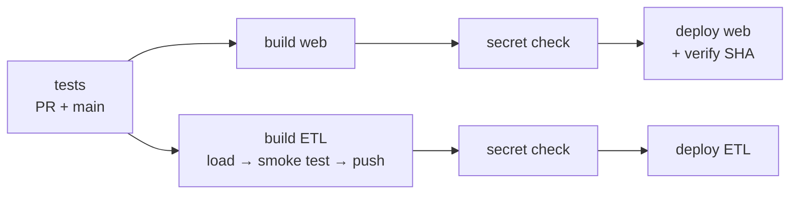

# Delivery

Two images, seven CI jobs, two independent deployment tracks, and one gate that decides whether any
of it actually happened.

## Two images

The web image and the ETL image are separate. unixODBC, the Microsoft ODBC driver and the ERP
credential exist only in the ETL image; the web application code never enters it. A credential that
cannot reach a process cannot be leaked by it.

**Web image.** `python:3.12-slim`, single stage, non-root, gunicorn with threaded workers because
they spend most of their time waiting on PostgreSQL rather than burning CPU. Dependencies install
from an exact lock with `--no-deps`, followed by `pip check`, so adding a dependency and forgetting
to regenerate the lock fails the build instead of failing the container in production with an import
error. The commit SHA arrives as a build argument declared after the install layers, since declaring
it before would invalidate their cache on every commit.

The health check probes readiness, not liveness. The previous configuration kept reporting healthy
for a measured sixty seconds with PostgreSQL stopped, while every screen returned an error.

**ETL image.** No port, no HTTP endpoint, no application code, non-root, and without owning the
application directory, so the code is read-only to the process. Its supply chain is pinned
deliberately:

- The vendor's APT signing key is downloaded and verified against a pinned SHA-256 before it becomes
  a trusted keyring. A swapped key otherwise means silently trusting packages signed by someone
  else.
- The distribution codename comes from `/etc/os-release` at build time rather than being hardcoded,
  so a base-image bump fails loudly at package resolution instead of installing the wrong thing.
- `libgssapi-krb5-2` is installed explicitly because of a production incident: without it the ODBC
  driver registers correctly and the first connection dies with a missing-library error.

## The build that tests itself before publishing

The ETL image is built with `load: true, push: false`, then a smoke test runs inside the built
image. It loads the ODBC driver, attempts a connection to a dead port expecting a refusal, and
verifies the timezone database is present. Only then are the tags pushed by hand, SHA first and
`latest` second, so a mid-push failure leaves `latest` on the previous good version.

With a normal push-on-build, an image missing its driver would already be on `latest` when the smoke
test failed.

## CI details that are not decoration

- **Workflow-level read-only token permissions.** The test job runs code from pull requests, and a
  write-scoped token there is a supply-chain path into the default branch. For fork PRs the token is
  already read-only and secrets are withheld, so the case this actually covers is same-repo branch
  PRs, which is the case this repo has. Only the two build jobs re-grant package write.
- **`concurrency` with `cancel-in-progress`.** Two quick pushes with different cache warmth, the
  second finishing first, and the first then overwrites `latest` with older code. The SHA tags stay
  correct, which makes the diagnosis harder rather than easier.
- **The CI interpreter is pinned to what the image runs**, not to what the development machine runs.
  A construct valid only on a newer interpreter would otherwise pass green and crash the container.
- **The lock installs before the editable install**, so the suite runs against exactly the versions
  that go into the image.
- **A job exists purely to make skipping honest.** The `secrets` context is not available in a
  job-level `if:`, so the only way for a deploy to show as skipped rather than green-without-having-
  deployed is for a previous job to turn "does the secret exist?" into a job output. It emits a
  warning and a remediation command. The tempting alternative, `continue-on-error`, is the same
  problem swept under the rug.
- **The two tracks are separate jobs.** When the extractor build fails because a vendor repository
  is down, the website still reaches its deploy, so an urgent site fix is not held hostage by a
  component the site does not use.

## The deploy gate

A deploy hook returning 200 means the request was accepted. It does not mean anything was deployed;
the old container keeps answering 200 perfectly well.

So the commit SHA travels from the workflow into a build argument, into an environment variable,
into the application's health endpoint. After firing the hook, the job polls production every five
seconds for up to 180 seconds and exits zero only when the endpoint reports that exact SHA. Non-JSON
responses count as the wrong version rather than as success, and a hard job timeout sits above the
loop rather than inside it.

Three distinct failure messages, keyed on the HTTP client's exit code: DNS not resolving, responded
but never with the right version, and no response at all. A deleted DNS record and a broken
container produce the same silence, and that ambiguity once cost a night spent debugging a deploy
that was working.

The 180-second window has its own story, recorded in the workflow:

> I raised it to 420 seconds believing the two previous failures were a window that was too short. I
> was wrong. Probing production every two seconds through a real deploy — 62 samples over roughly
> two minutes — zero came back without a response. The failures were a deleted DNS record. The gate
> was right, so I reverted the window to 180.

Loosening a gate on a wrong diagnosis is how safety nets die quietly.

## Testing

A backend suite in pytest and a separate suite for screen logic under `node --test`, because
formatting, ordering and labelling rules are business rules that happen to be written in JavaScript.

The fixture design is the interesting part. A session-scoped connection pool; function-scoped
truncation with identity reset so ids are deterministic; and two tracks of application fixture, one
without a database for fast route and HTTP tests and one wired to a real test database. The ETL
tests take their own connection rather than the application pool, mirroring production, where the
load holds a session-level lock on a dedicated connection.

One named anti-pattern governs the suite: an assertion that passes for the wrong reason. The rule
that follows is mechanical. Before believing a protection works, remove it and check that a test
complains.

## What is missing

- Branch protection and required review are not configured. At two developers the review gate was
  traded away knowingly. It is the first thing I would add, and the first thing I would insist on at
  any larger team size.
- No staging environment.
- No automated rollback. The immutable SHA tags make rollback deterministic, but it is manual.
- The ETL deploy has no verification, because the service has no HTTP endpoint to ask.
- Coverage is a declared dependency and is never invoked.

---

**Related:** [ADR-0003](adr/0003-delete-not-truncate.md) · [ADR-0005](adr/0005-in-process-scheduler.md)
