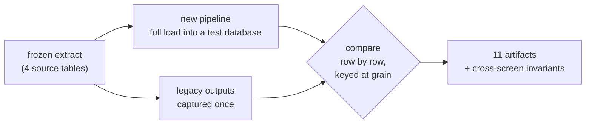

# Proving it correct

The hardest problem in replacing a reporting system is not building the new one. It is convincing an
organization that the new numbers are right when they disagree with the numbers everyone already
trusts.

"I checked the totals and they match" is not an answer. Totals match for many reasons, including two
errors cancelling.

## The approach

Freeze one real extract. Keep, alongside it, the exact outputs the legacy application produced from
that same extract. Then run the new system against the frozen extract and compare every cell.



Eleven artifacts, across five kinds of check:

| Kind | Count | What is compared | What it proves |
|---|---|---|---|
| Grain | 1 | the comparative grain table, row by row | the transformation reproduces the legacy model exactly |
| Aggregate | 4 | KPI sets, rankings, the account × cost-centre matrix, consolidated accounts | the query layer aggregates identically |
| Screen payload | 5 | the JSON each screen actually renders | what the user sees matches, not only what the database holds |
| Oracle | 1 | the legacy application's own verification script | an independent answer key rather than a self-generated expectation |
| Invariant | — | the same KPI as computed by two different screens | internal consistency |

Comparison runs through the real production code path, the same query functions the web application
calls, with a total access scope. A harness that reimplements what it tests proves only that you can
write the same bug twice.

## There is no numeric tolerance

This is the design decision I like most in the system.

Almost every parity harness compares with an epsilon, because floating-point arithmetic makes exact
equality impractical. That epsilon then becomes the place where real errors hide.

Instead the tolerance was pushed upstream into the type system. Money is converted once, at ingest,
into decimal values quantized to the cent, rejecting anything that is not an exact multiple. The
only tolerance anywhere is one ten-thousandth of a cent, applied at the single point where a float
is read from the source. Every aggregation downstream is decimal.

So comparison is exact equality, and a one-cent difference is a failure rather than a rounding
discussion. One caveat, since the claim is strong: the screen-level artifacts are compared after
serialization to float, which is deterministic and therefore safe, but the decimal guarantee proper
covers everywhere the arithmetic happens. Serializing money as a string would close even that.

## Provenance, so the harness cannot lie to itself

A golden dataset drifting silently is worse than no golden dataset, because it produces confident
green.

- The extract files are hashed and checked against a recorded manifest before anything runs.
- The screen-level goldens carry their own manifest, and its input hashes must equal the main one.
  Otherwise the screen expectations came from a different extract than the grain expectations, which
  would be both undetectable and meaningless.
- The output files are hashed too, so goldens regenerated from a different run report as unverified
  rather than as failed.
- On success a stamp of the input hashes is written and committed; CI fails if the listed files
  changed without a fresh stamp. Hashes normalize line endings, because the development machine and
  the runner disagree about them.

The harness also fixes "today" from the generation timestamp in the manifest, because the default
period on a filter screen depends on the current date and a regression must not depend on the clock
of whoever runs it.

## Four exit codes

```
0  approved
1  rejected      — it compared, and the numbers differed
2  not verified  — it could not compare
3  unexpected error
```

The governing principle: "I did not verify" must never look like "I verified and it failed".

All input validation happens before any comparison, so a corrupt manifest or a malformed golden file
exits 2, never 1. Even a successful comparison whose stamp could not be written exits 3, with an
explicit note that this is not a rejection. Collapsing these into pass/fail produces false red,
which trains everyone to ignore red.

## One more guard

The harness drops and recreates schemas, so before anything else it refuses to run against a
database whose name does not end in a test suffix. That check is ordered first, ahead even of input
validation, so no code path reaches the destructive statement without passing it.

It recreates rather than reuses because idempotent DDL is a no-op against an existing table. A run
could otherwise validate against the old shape of a table while stamping the hash of the new schema
file. Green, and wrong.

## What it caught

Cell-level comparison surfaced three classes of defect that totals-level checking had been passing
for years, each then confirmed independently against the source system's own trial balance:

- **A sign-convention error on contra entries.** Credits on expense accounts were added rather than
  subtracted. The grand total looked reasonable; individual cost centres did not.
- **Budget revisions deduplicated rather than resolved.** Establishing the correct rule meant proving
  that a new revision preserves the sum over the keys it touches, to the cent, which is what makes it
  a reallocation rather than an addition.
- **Period-boundary entries classified as operating spend.** The fix keys on the entry-batch naming
  convention rather than the posting date, because legitimate payroll and allocation batches post on
  the same day.

Each of them started as a single non-matching cell. None was visible in a total.

## The cost

The fixtures are real accounting values, so the harness cannot run in CI and lives on one machine.
That is a bus factor of one on the asset that makes everything else trustworthy. Building it on
synthetic fixtures would have been more work up front and was the right call.

I am extracting the pattern as a small standalone library — grain-level comparison under exact
decimal arithmetic, provenance hashing, and the four-valued exit code. It will be linked here when
it is public.
